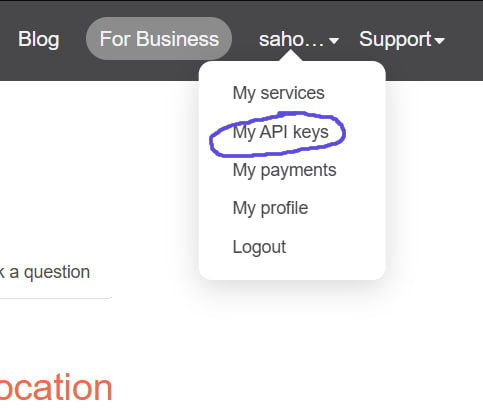
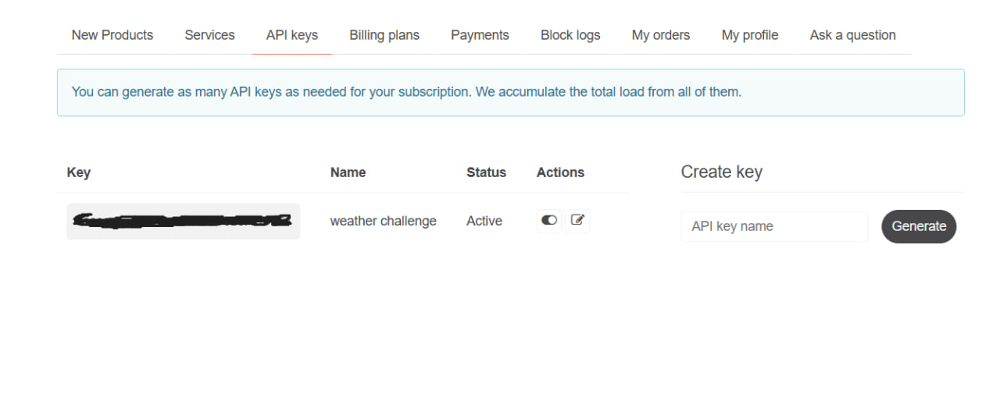

# Okala - Weather API Challenge

This is a .NET Web API that fulfills the Okala backend developer challenge. It provides current environmental data for a given city by fetching and combining data from the OpenWeatherMap API.

## Features

* **GET /weather** endpoint to retrieve data for a city.
* **In-Memory Caching:** Caches results for 15 minutes to dramatically improve performance and reduce external API calls.
* **Structured Logging:** Logs all errors to the console for effective debugging without exposing details to the user.
* Combines data from `/weather` and `/air_pollution` endpoints.
* Clean, service-based architecture (using DTOs and a Service layer).
* Includes an integration test that mocks the external API.

## How to Run

1.  ### Prerequisites
    * .NET 8 SDK 
    * A free API key from [OpenWeatherMap](https://openweathermap.org/) (Instructions below)

2.  ### Getting Your API Key (Required)
    This project **requires** an API key from OpenWeatherMap to run.

    1.  Go to [https://openweathermap.org/](https://openweathermap.org/) and sign in.
    2.  After signing in, click your **username** at the top right of the page to open a dropdown menu.
    3.  Click on **"My API keys"** from the menu.

        

    4.  On the API keys page, give your key a name (e.g., "OkalaTest") in the **"Create key"** box and click **"Generate"**.

        

    5.  Copy the new API key that appears in your list.
    *(Note: It may take 5-10 minutes for a new key to become active.)*

3.  ### Clone the Repository
    ```sh
    git clone https://github.com/Amir-Hossein-Seraji/weather_api.git
    cd weather_api
    ```

4.  ### Configure Your API Key
    This project uses .NET User Secrets to protect the API key. You **must** add your new key:

    ```sh
    # Navigate into the main API project
    cd WeatherApi

    # Initialize user secrets for the project
    dotnet user-secrets init

    # Set your API key
    dotnet user-secrets set "OpenWeather:ApiKey" "YOUR_OPENWEATHERMAP_API_KEY_GOES_HERE"
    ```

5.  ### Run the Application
    ```sh
    # Go back to the root folder
    cd ..

    # Run the API project
    dotnet run --project WeatherApi
    ```

6.  ### Test the API
    Once the app is running, open your browser and go to the Swagger UI:
    **`http://localhost:5223/swagger`** *(Your port might be different. The terminal will tell you which port it is using.)*

## How to Run the Test

The automated test **does not** require an API key as it mocks the external service.

```sh
dotnet test
